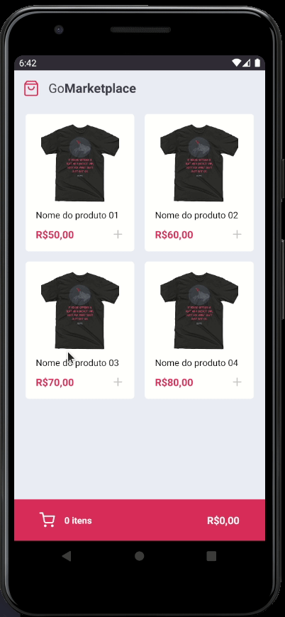

# Go Market Place - Mobile
> ⚒👷 __UNDER CONSTRUCTION__ 👷⚒

## Description

A place for you buy anything.

## App

## Why

This is the 8th challenge from the course Go Stack from [Rocket Seat](https://github.com/Rocketseat). And I'm adding this project for my personal portifolio, so if you could let me any feedback I'd appreciate so much. Any comment that can make me a better programmer will be help a lot!

And for sure, you can use this Project as you wish!

It's free!

## Contact info

My [LinkedIn](https://www.linkedin.com/in/bruno8moura/)

My email bruno8moura@gmail.com

## Getting started

### Prerequisites

NodeJS version: ^12

## Running application

yarn start

## Build with

